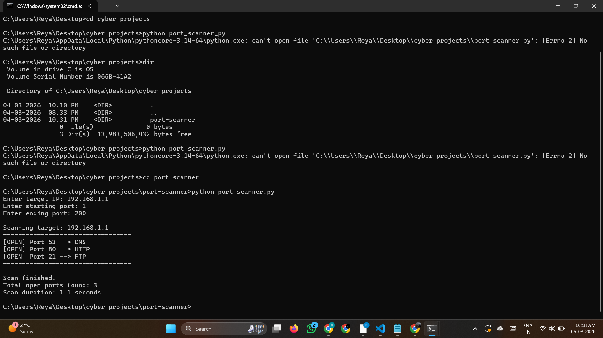

<<<<<<< HEAD
Multithreaded Cyber Port Scanner

About The Project
This project is a **multithreaded port scanner** developed using Python.  
It helps in identifying open network ports and detecting potential security exposure points.

Features 
        - Multithreaded fast scanning
	- Service detection capability	
	- Detects open ports efficiently
	- Command line based tool

Technologies Used
	- Python
	- Socket Programming
	- Threading

📸 Screenshots


## 📌 How to Run
```bash
python port_scanner.py 

##Author
 ~Reyabalaveni P
GitHub: https://github.com/reyabalavenip
LinkedIn: https://linkedin.com/in/reyabalaveni-p
=======
# MultiThreaded-port-scanner
A fast multi-threaded port scanner built using Python sockets and ThreadPoolExecutor.
>>>>>>> 6f3afbd6119b3ebaf82f93e06e1d26a1127dea86
